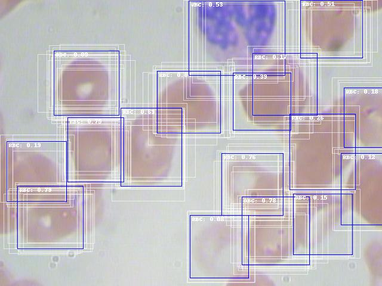

# Faster-RCNN-with-FPN-in-pytorch

## About this Repo?
This is a continuation of my work on https://github.com/machingclee/Minimal-Code-for-Faster-RCNN-in-pytorch. 

Since modifying the old code that accepts multi-scale features contradicts my will to keep the code succint and direct for study, I decided to create another repo that focus on multi-scale features taken by the rpn network for predictions. 

Reader can study how to jump from one-scale to multi-scale by studying the code difference.
## Result
Faded white boxes are ROIs and blue boxes are the refined ROIs, where the refinements are predicted from features generated by ROIAlign module:

</div<

